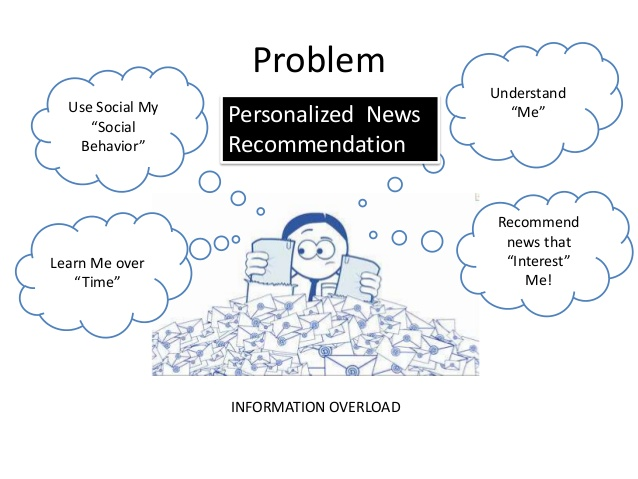
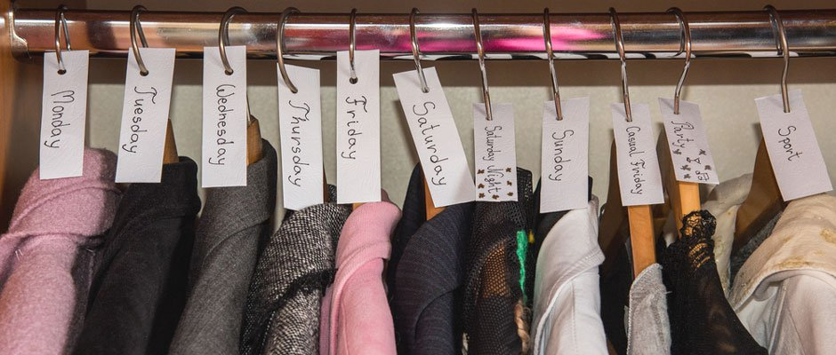
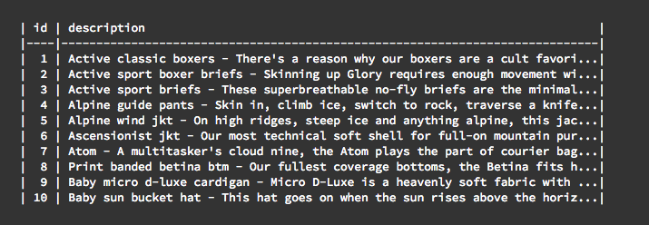
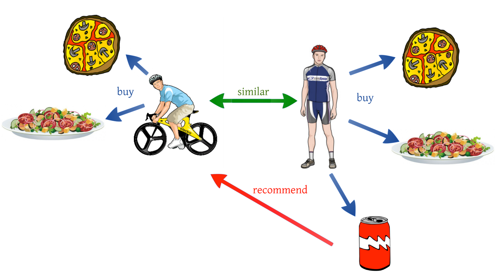
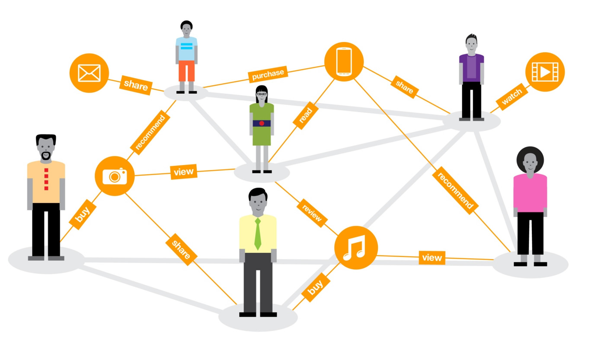

<p align="center">
  
</p>

<h1 align="center"> Types of Recommendation Engine </h1> <br>

<p align="center">
  
</p>
Before taking a look at different types of recommendation engine, let’s take a step back and see if we can make some intuitive recommendations. Consider the following cases:

## Case 1: Recommend the most popular items
<p align="center">
  
</p>
A simple approach could be to recommend items which are liked by the most number of users. This is a blazing fast and dirty approach and thus has a major drawback. The thing is, there is no personalization involved with this approach.

Basically, the most popular items would be identical for each user since popularity is against the entire user pool. So, everybody will see the same result. It sounds like, ‘a website recommending you to buy a microwave just because it’s been liked by other users and doesn’t care if you are even interested in buying or not’.

Surprisingly, such approach still works in services like news portals. When you login to say bbc news, you’ll see a column of “Popular News” which is subdivided into sections and the most read articles of each sections are displayed. This approach can work in this case because sections are divided allowing for a user to look at a particular section of interest.
At a time, there are only a few hot topics and there is a high chance that a user wants to read news that is read by the majority of other users.

## Case 2: Using a classifier to make recommendation

<p align="left">
  
</p>
We already know lots of classification algorithms. Let’s see how we can use the same technique to make recommendations. Classifiers are parametric solutions so we just need to define some parameters (features) of the user and the item. The outcome can be  `1` if the user likes it or  `0` otherwise. This might work out in some cases because of following advantages:

1. Incorporates personalization
It can work even if the user’s past history is short or not available. However, this has some major drawbacks as well because it is not commonly practiced.

1. The features might not be available or even if they are, they may not be sufficient to make a good classifier. The results of this is that as the number of users and items grow, making a good classifier will become exponentially difficult.


## Case 3: Recommendation Algorithms
Now let’s come to the special class of algorithms which are tailor-made for solving the recommendation problem. There are typically two types of algorithms – Content Based and Collaborative Filtering. You should refer to our previous article to get a complete sense of how they work. I’ll give a short recap here.

## Content based algorithms
<p align="center">
  
</p>
Idea: If you like an item then you will also like a “similar” item. This is based on the similarity of the items being recommended.
It generally works well when it’s easy to determine the context/properties of each item. For instance, when we are recommending the same kind of item like a movie or song.
Like many algorithms, we can use a bunch of off-the-shelf libraries to make life pretty easy. But before we get to the big reveal and look at the code, let's talk through the approach.
[Link](https://gist.github.com/octamois/28b3b220b86ef12e98321a1d1b51fb78) is provided a sample dataset of outdoor clothing and products from Patagonia.
<p align="left">

</p>
That's it; just IDs and text about the product in the form Title - Description. We're going to use a simple Natural Language Processing technique called TF-IDF (Term Frequency - Inverse Document Frequency) to parse through the descriptions, identify distinct phrases in each item's description, and then find 'similar' products based on those phrases.

TF-IDF works by looking at all (in our case) one, two, and three-word phrases (uni-, bi-, and tri-grams to NLP folks) that appear multiple times in a description (the "term frequency") and divides them by the number of times those same phrases appear in all product descriptions. So terms that are 'more distinct' to a particular product ("Micro D-luxe" in item 9, above) get a higher score, and terms that appear often, but also appear often in other products ("soft fabric", also in item 9) get a lower score.

Once we have the TF-IDF terms and scores for each product, we'll use a measurement called [cosine similarity](http://blog.christianperone.com/2013/09/machine-learning-cosine-similarity-for-vector-space-models-part-iii) to identify which products are 'closest' to each other.

Luckily, like most algorithms, we don't have to reinvent the wheel; there are ready-made libraries that will do the heavy lifting for us. In this case, Python's SciKit Learn has both a [TF-IDF](http://scikit-learn.org/stable/modules/generated/sklearn.feature_extraction.text.TfidfVectorizer.html) and [cosine similarity](http://scikit-learn.org/stable/modules/metrics.html#cosine-similarity) implementation.

The engine has a '''.train()''' method that runs TF-IDF across the input products file, computes similar items for every item in the set, and stores those items along with their cosine similarity, in Redis. The '''.predict'''' method just takes an item ID and returns the precomputed similarities from Redis.

The engine code in its entirety is below.
Some basic Git commands are:
```python
import pandas as pd
import time
import redis
from flask import current_app
from sklearn.feature_extraction.text import TfidfVectorizer
from sklearn.metrics.pairwise import linear_kernel

def info(msg):
    current_app.logger.info(msg)

class ContentEngine(object):

    SIMKEY = 'p:smlr:%s'

    def __init__(self):
        self._r = redis.StrictRedis.from_url(current_app.config['REDIS_URL'])

    def train(self, data_source):
        start = time.time()
        ds = pd.read_csv(data_source)
        info("Training data ingested in %s seconds." % (time.time() - start))

        # Flush the stale training data from redis
        self._r.flushdb()

        start = time.time()
        self._train(ds)
        info("Engine trained in %s seconds." % (time.time() - start))

    def _train(self, ds):
        """
        Train the engine.

        Create a TF-IDF matrix of unigrams, bigrams, and trigrams
        for each product. The 'stop_words' param tells the TF-IDF
        module to ignore common english words like 'the', etc.

        Then we compute similarity between all products using
        SciKit Leanr's linear_kernel (which in this case is
        equivalent to cosine similarity).

        Iterate through each item's similar items and store the
        100 most-similar. Stops at 100 because well...  how many
        similar products do you really need to show?

        Similarities and their scores are stored in redis as a
        Sorted Set, with one set for each item.

        :param ds: A pandas dataset containing two fields: description & id
        :return: Nothin!
        """
        tf = TfidfVectorizer(analyzer='word',
                             ngram_range=(1, 3),
                             min_df=0,
                             stop_words='english')
        tfidf_matrix = tf.fit_transform(ds['description'])

        cosine_similarities = linear_kernel(tfidf_matrix, tfidf_matrix)

        for idx, row in ds.iterrows():
            similar_indices = cosine_similarities[idx].argsort()[:-100:-1]
            similar_items = [(cosine_similarities[idx][i], ds['id'][i])
                             for i in similar_indices]

            # First item is the item itself, so remove it.
            # This 'sum' is turns a list of tuples into a single tuple:
            # [(1,2), (3,4)] -> (1,2,3,4)
            flattened = sum(similar_items[1:], ())
            self._r.zadd(self.SIMKEY % row['id'], *flattened)

    def predict(self, item_id, num):
        """
        Couldn't be simpler! Just retrieves the similar items and
        their 'score' from redis.

        :param item_id: string
        :param num: number of similar items to return
        :return: A list of lists like: [["19", 0.2203],
        ["494", 0.1693], ...]. The first item in each sub-list is
        the item ID and the second is the similarity score. Sorted
        by similarity score, descending.
        """
        return self._r.zrange(self.SIMKEY % item_id,
                              0,
                              num-1,
                              withscores=True,
                              desc=True)

content_engine = ContentEngine()
```


## Collaborative filtering algorithms
Idea: If person `A` likes item `1, 2, 3` and `B` likes `2,3,4` then they have similar interests. Therefore, person `A` should like item `4`, and person `B` should like item `1`.
This algorithm is entirely based on the past behaviour of other persons and not on the context. This makes it one of the most commonly used algorithm as it is not dependent on any additional information. 
For instance, product recommendations by e-commerce player like Amazon and merchant recommendations by banks like American Express.

Further, there are several types of collaborative filtering algorithms: User-User, Item-Item, and et al.

## User-User Collaborative filtering
<p align="center">
  
</p>
Here we find look-a-like customers (based on similarity) and offer products to the first customer that are similar to a look-a-like customer’s past behaviour. This algorithm is very effective but takes a lot of time and resources. It requires us to compute every customer information pair which takes time. Therefore, for big base platforms, this algorithm is hard to implement without a very strong parallelizable system.

## Item-Item Collaborative filtering
<p align="center">
  
</p>
It is quite similar to the previous algorithm, but instead of finding alike customers, we try finding an alike item. Once we have the item look-a-like matrix, we can easily recommend alike items to customer who have purchased any item from the store. This algorithm is far less resource consuming than user-user collaborative filtering. Hence, for a new customer the algorithm takes far less time than the User-User Collaborate filtering as we don’t need all similarity scores between customers. And with fixed number of products the Product-Product look-a-like matrix is fixed over time.

Other simpler algorithms: There are other approaches like market basket analysis, which generally do not have high predictive power than the algorithms described above.

## Hybrid recommendation systems 
<p align="center">
  
</p>
Hybrid recommendation systems combine both collaborative and content-based approaches. They help improve recommendations that are derived from sparse datasets. The Netflix algorithm is a prime example of a hybrid recommender.
